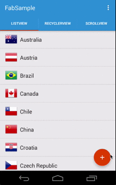

# Floating Action Button for Xamarin.Android and Xamarin.Forms

Ported from: https://github.com/makovkastar/FloatingActionButton

### Description

Android floating action button which reacts on scrolling events. Becomes visible when an attached target is scrolled up and invisible when scrolled down.



### Integration Xamarin.Android

**1)** Add the NuGet to your Project: https://www.nuget.org/packages/Refractored.FloatingActionButton/


**2)** Add the ``Refractored.Fab.FloatingActionButton`` to your layout XML file. The button should be placed in the bottom right corner of the screen. The width and height of the floating action button are hardcoded to **56dp** for the normal and **40dp** for the mini button as specified in the [guidlines].

```xml
<FrameLayout xmlns:android="http://schemas.android.com/apk/res/android"
             xmlns:fab="http://schemas.android.com/apk/res-auto"
             android:layout_width="match_parent"
             android:layout_height="match_parent">

    <ListView
            android:id="@android:id/list"
            android:layout_width="match_parent"
            android:layout_height="match_parent" />

    <Refractored.Fab.FloatingActionButton
            android:id="@+id/fab"
            android:layout_width="wrap_content"
            android:layout_height="wrap_content"
            android:layout_gravity="bottom|right"
            android:layout_margin="16dp"
            android:src="@drawable/ic_action_content_new"
            fab:fab_colorNormal="@color/primary"
            fab:fab_colorPressed="@color/primary_pressed"
            fab:fab_colorRipple="@color/ripple" />
</FrameLayout>
```

**3)** Attach the FAB to ``AbsListView``, ``RecyclerView`` or ``ScrollView`` :

```csharp
var listView = FindViewById<ListView>(Android.Resource.Id.list);
var fab = FindViewById<FloatingActionButton>(Resource.Id.fab);
fab.AttachToListView(listView);
```

Check the sample project to see how to use custom listeners if you need to track scroll events.

**4)** Add the namespace ``xmlns:fab="http://schemas.android.com/apk/res-auto"`` to your layout file.

+ Set the button type (normal or mini) via the ``fab_type`` xml attribute (default is normal):

    ```xml
    fab:fab_size="mini"
    ```
    or
    ```csharp
    fab.Size = FabSize.Mini;
    ```
+ Set the normal and pressed colors via the xml attributes:

    ```xml
    fab:fab_colorNormal="@color/primary"
    fab:fab_colorPressed="@color/primary_pressed"
    ```
    or
    ```csharp
    fab.ColorNormal = Resources.GetColor(Resource.Color.primary);
    fab.ColorPressed = Resources.GetColor(Resource.Color.primary_pressed);
    ```
    
+ Enable/disable the button shadow with the ``fab_shadow`` xml attribite (it's enabled by default):

    ```xml
    fab:fab_shadow="false"
    ```
    or
    ```csharp
    fab..HasShadow = false;
    ```
    
+ Show/hide the button expliciltly:
    
    ```csharp
    fab.Show();
    fab.Hide();
    
    fab.Show(false); // Show without an animation
    fab.Hide(false); // Hide without an animation
    ```
    
+ Specify the ripple color for API 21+:

    ```xml
    fab:fab_colorRipple="@color/ripple"
    ```

    or
   ```java
   fab.ColorRipple = Resources.GetColor(Resource.Color.ripple);
   ```

**5)** Set an icon for the ``FloatingActionButton`` using ``android:src`` xml attribute. Use drawables of size **24dp** as specified by [guidlines]. Icons of desired size can be generated with [Android Asset Studio].

### Integration Xamarin.Forms
See sample app for integration

XAML Example:
```xml
<?xml version="1.0" encoding="utf-8" ?>
<ContentPage xmlns="http://xamarin.com/schemas/2014/forms"
             xmlns:x="http://schemas.microsoft.com/winfx/2009/xaml"
             x:Class="Microsoft.Mvpui.ContributionsPage"
             xmlns:fab="clr-namespace:Refractored.FabControl;assembly=Refractored.FabControl">

    <ContentPage.Content>
		<AbsoluteLayout VerticalOptions="FillAndExpand" HorizontalOptions="FillAndExpand">
				<ListView 
						  AbsoluteLayout.LayoutFlags="All"
						  AbsoluteLayout.LayoutBounds="0,0,1,1">

			</ListView>
			<fab:FloatingActionButtonView
				ImageName="toolbar_add.png"
				ColorNormal="{StaticResource Primary}"
				ColorPressed="{StaticResource PrimaryDark}"
				ColorRipple="{StaticResource PrimaryDark}"
				x:Name="FloatingActionButtonAdd"
				IsVisible="False"
				AbsoluteLayout.LayoutFlags="PositionProportional"
				AbsoluteLayout.LayoutBounds="1, 1, AutoSize, AutoSize"/>
		</AbsoluteLayout>
	</ContentPage.Content>
</ContentPage>
```

### Links

Country flag icons used in the sample are taken from www.icondrawer.com


# License

The MIT License (MIT)

Copyright (c) 2017 James Montemagno / Refractored LLC

Permission is hereby granted, free of charge, to any person obtaining a copy of this software and associated documentation files (the "Software"), to deal in the Software without restriction, including without limitation the rights to use, copy, modify, merge, publish, distribute, sublicense, and/or sell copies of the Software, and to permit persons to whom the Software is furnished to do so, subject to the following conditions:

The above copyright notice and this permission notice shall be included in all copies or substantial portions of the Software.

THE SOFTWARE IS PROVIDED "AS IS", WITHOUT WARRANTY OF ANY KIND, EXPRESS OR IMPLIED, INCLUDING BUT NOT LIMITED TO THE WARRANTIES OF MERCHANTABILITY, FITNESS FOR A PARTICULAR PURPOSE AND NONINFRINGEMENT. IN NO EVENT SHALL THE AUTHORS OR COPYRIGHT HOLDERS BE LIABLE FOR ANY CLAIM, DAMAGES OR OTHER LIABILITY, WHETHER IN AN ACTION OF CONTRACT, TORT OR OTHERWISE, ARISING FROM, OUT OF OR IN CONNECTION WITH THE SOFTWARE OR THE USE OR OTHER DEALINGS IN THE SOFTWARE.


This is a derivative of Melnykov Oleksandr's Floating Action Button:  https://github.com/makovkastar/FloatingActionButton under MIT
